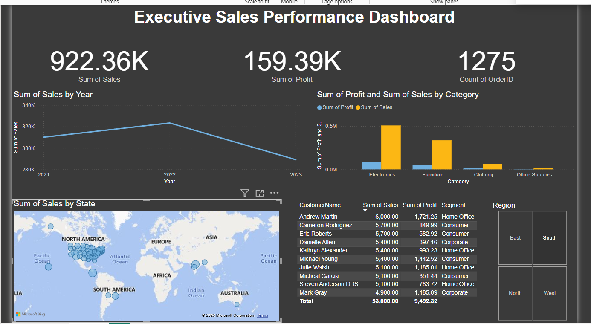

# End-to-End Sales Data Analysis Project

## Project Overview
This project demonstrates a full, end-to-end data analysis workflow. It begins with raw data generation, proceeds to data cleaning and transformation, followed by database querying for business insights, and culminates in the creation of an interactive business intelligence dashboard.

---

### Tools Used
- **Python:** For data generation, cleaning, and transformation.
  - **Libraries:** Pandas, Faker, NumPy
- **SQL:** For querying the cleaned data to extract business intelligence insights.
  - **Database:** SQLite
- **Power BI:** For creating a dynamic and interactive data visualization dashboard.
- **Git & GitHub:** For version control and project showcasing.

---

### Project Phases

#### Phase 1: Data Generation
- A synthetic dataset of 5,000 sales records was generated using the Python `Faker` library.
- The dataset includes fields such as Order ID, Order Date, Customer Segment, Region, Product Category, Sales, Quantity, Discount, and Profit.
- The script `generate_data.py` contains the logic for this process.

#### Phase 2: Data Cleaning & Transformation (Python - Pandas)
- The raw data (`raw_sales_data.csv`) was loaded into a Pandas DataFrame.
- **Cleaning Steps:**
  - Converted `OrderDate` and `ShipDate` columns to datetime objects.
  - Checked for and handled any missing values or duplicates.
- **Feature Engineering:**
  - Created new columns like `OrderYear`, `OrderMonth`, and `ShippingDays` to facilitate time-series analysis.
  - Calculated `ProfitMargin` for deeper profitability analysis.
- The final, clean dataset was saved as `cleaned_sales_data.csv`. The entire process is documented in the Jupyter Notebook `data_cleaning.ipynb`.

#### Phase 3: SQL for Business Intelligence
- The cleaned dataset was loaded into an SQLite database (`sales_database.db`) using the `load_to_db.py` script.
- Wrote complex SQL queries to answer key business questions, such as:
  - What are the total sales and profit by product category?
  - Who are the top 10 most valuable customers?
  - What is the monthly sales trend?
  - Which region is the most profitable?
- All queries are stored in `sql_queries/business_insights_queries.sql`.

#### Phase 4: Visualization & Reporting (Power BI)
- Connected Power BI to the cleaned dataset.
- Developed an interactive dashboard to visualize the insights derived from the SQL queries.
- The dashboard features:
  - KPI cards for total sales, profit, and order count.
  - A time-series line chart for monthly sales trends.
  - Bar charts comparing sales and profit across categories and segments.
  - A map visualization for geographical sales performance.
  - Slicers for Region and Category to allow for interactive data filtering.

### Dashboard Preview


---

### How to Run This Project
1. **Clone the repository:**
   ```bash
   git clone https://github.com/sushmitha-shettigar28/Sales-Data-Analysis-Portfolio-Project.git
